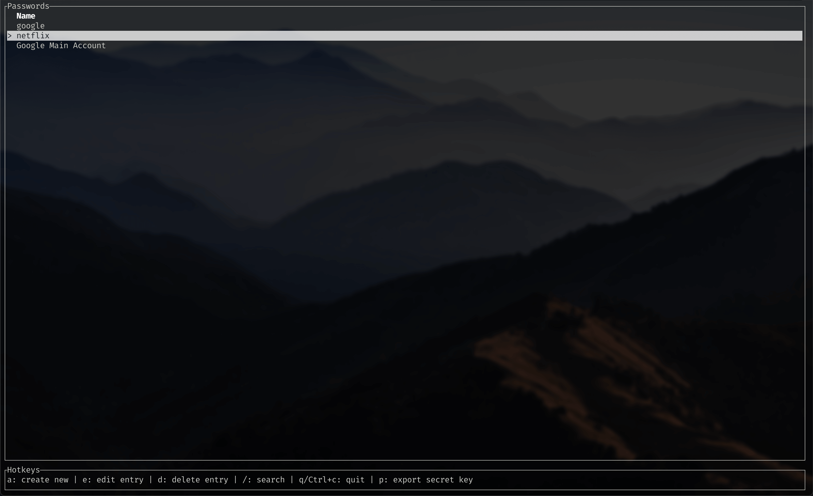
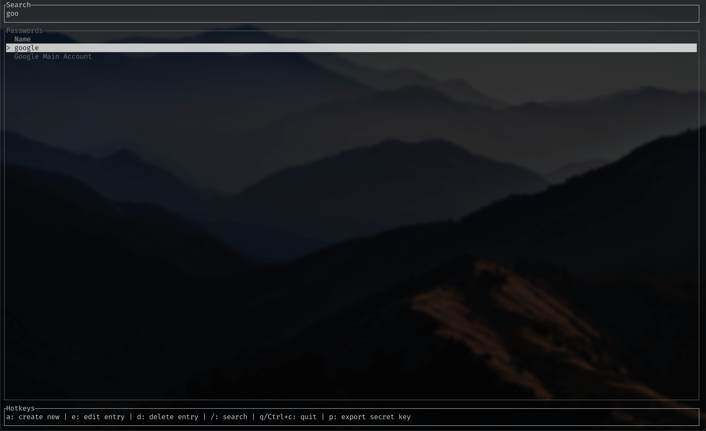

# passm 🔒

 <b>Self hosted password management simplified</b>

 

**Passm strives to make self hosted password management as easy as possible.** 

Main idea of this project is to be as easy in use as centralised password managers (e.g. lastpass) by providing syncing capabilities to user owned storages. Passwords and encrypting keys are stored localy but can be exported and imorted from multiple providers (e.g. Dropbox, github). While passwords are encrypted by user's pgp private keys, private keys themselfs are encrypted with master password when exported.

 

## Run debug

`cargo run --bin passm`

## Roadmap

- [x] PGP key generation
- [x] Create/Edit/Delete you passwords
- [x] Export excrypted pgp secret key to local storage
- [ ] Sync passwords with a storage of you choise
    - [ ] Dropbox
    - [ ] ...
